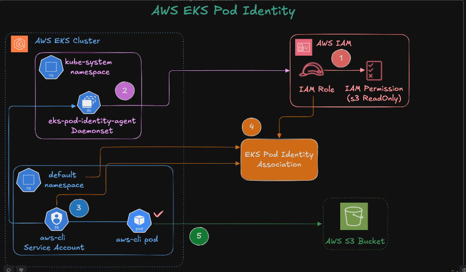
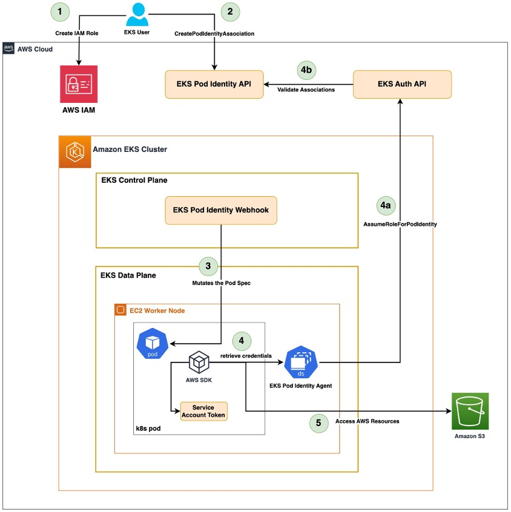
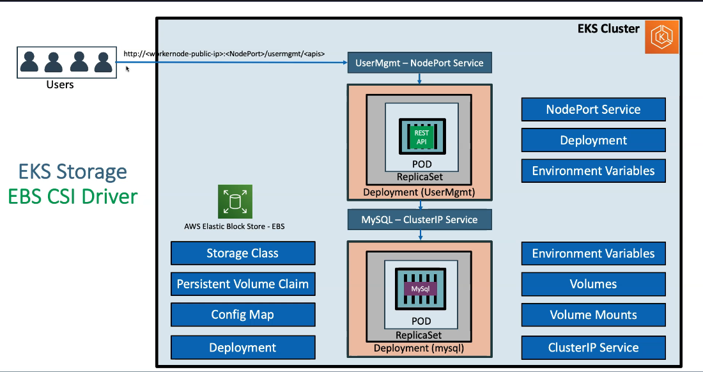

## Step-01: Create EKS Cluster using eksctl
eksctl create cluster --name=eksdemo1 \
                      --region=us-east-1 \
                      --zones=us-east-1a,us-east-1b \
                      --without-nodegroup 
## Step-02: Create & Associate IAM OIDC Provider for our EKS Cluster
To enable and use AWS IAM roles for Kubernetes service accounts on our EKS cluster
eksctl utils associate-iam-oidc-provider \
    --region us-east-1 \
    --cluster eksdemo1 \
    --approve
## Step-03: Create EC2 Keypair
This will help us to login to the EKS Worker Nodes using Terminal.

## Step-04: Create Node Group with additional Add-Ons in Public Subnets
eksctl create nodegroup --cluster=eksdemo1 \
                        --region=us-east-1 \
                        --name=eksdemo1-ng-public1 \
                        --node-type=t3.medium \
                        --nodes=2 \
                        --nodes-min=2 \
                        --nodes-max=4 \
                        --node-volume-size=20 \
                        --ssh-access \
                        --ssh-public-key=kube-demo \
                        --managed \
                        --asg-access \
                        --external-dns-access \
                        --full-ecr-access \
                        --appmesh-access \
                        --alb-ingress-access 

Install the EKS Pod Identity Agent add-on
## Step-00: What we’ll do
# 1. Install the **EKS Pod Identity Agent** add-on  
This installs a **DaemonSet** (`eks-pod-identity-agent`) that enables Pod Identity associations.
kubectl get daemonset -n kube-system
kubectl get pods -n kube-system

# Step-02: Deploy AWS CLI Pod (without Pod Identity Association)

# Create role for pod to read s3 bucket 
# EKS-PodIdentity-S3-ReadOnly-Role-101
iam/role/aws service/eks/EKS - Pod Identity/s3

### Step-02-01: Create Service Account 
01_k8s_service_account.yaml
apiVersion: v1
kind: ServiceAccount
metadata:
  name: aws-cli-sa
  namespace: default

### Create a simple Kubernetes Pod with AWS CLI image:
02_k8s_aws_cli_pod.yaml
apiVersion: v1
kind: Pod
metadata:
  name: aws-cli
  namespace: default
spec:
  serviceAccountName: aws-cli-sa
  containers:
  - name: aws-cli
    image: amazon/aws-cli
    command: ["sleep", "infinity"]

# goto cluster
eksdemo1/access/pod identity/EKS-PodIdentity-S3-ReadOnly-Role-101/default/aws-cli-sa

k apply -f .
kubectl exec -it aws-cli -- aws s3 ls

3. Create an **IAM Role** with trust policy for Pod Identity → allow Pods to access **Amazon S3**  
4. Create a **Pod Identity Association** between the Kubernetes Service Account and IAM Role  
5. Re-test from the AWS CLI Pod, successfully list S3 buckets  
6. Through this flow, we will clearly understand how **Pod Identity Agent** works in EKS  