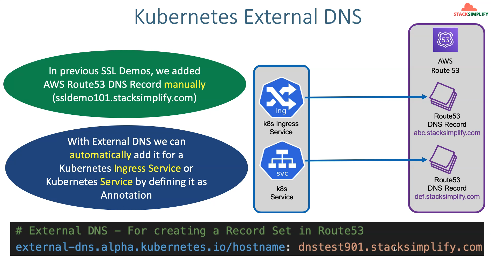

## Step-01: Create EKS Cluster using eksctl
        eksctl create cluster --name=eksdemo1 \
                      --region=us-east-1 \
                      --zones=us-east-1a,us-east-1b \
                      --without-nodegroup 
## Step-02: Create & Associate IAM OIDC Provider for our EKS Cluster
        To enable and use AWS IAM roles for Kubernetes service accounts on our EKS cluster
        eksctl utils associate-iam-oidc-provider \
            --region us-east-1 \
            --cluster eksdemo1 \
            --approve
## Step-03: Create EC2 Keypair
This will help us to login to the EKS Worker Nodes using Terminal.

## Step-04: Create Node Group with additional Add-Ons in Public Subnets
        eksctl create nodegroup --cluster=eksdemo1 \
                        --region=us-east-1 \
                        --name=eksdemo1-ng-public1 \
                        --node-type=t3.medium \
                        --nodes=2 \
                        --nodes-min=2 \
                        --nodes-max=4 \
                        --node-volume-size=20 \
                        --ssh-access \
                        --ssh-public-key=kube-demo \
                        --managed \
                        --asg-access \
                        --external-dns-access \
                        --full-ecr-access \
                        --appmesh-access \
                        --alb-ingress-access 

# #############################################################################################################
# this show that to list s3 bucket from eks/pod you need a service account
# #############################################################################################################
Install the EKS Pod Identity Agent add-on
# Step-00: What we’ll do
# 1. Install the **EKS Pod Identity Agent** add-on  
        This installs a **DaemonSet** (`eks-pod-identity-agent`) that enables Pod Identity associations.
        kubectl get daemonset -n kube-system
        kubectl get pods -n kube-system
        * add on pod identity from cluster
        Create role for pod to read s3 bucket 
        name:
        EKS-PodIdentity-S3-ReadOnly-Role-101

        iam/role/aws service/eks/EKS - Pod Identity/s3/create

## Step-02-01: Create Service Account 
        01_k8s_service_account.yaml :

        apiVersion: v1
        kind: ServiceAccount
        metadata:
          name: aws-cli-sa
          namespace: default

## Create a simple Kubernetes Pod with AWS CLI image:
        02_k8s_aws_cli_pod.yaml :

        apiVersion: v1
        kind: Pod
        metadata:
          name: aws-cli
          namespace: default
        spec:
          serviceAccountName: aws-cli-sa
          containers:
          - name: aws-cli
            image: amazon/aws-cli
            command: ["sleep", "infinity"]

## goto cluster
        eksdemo1/access/pod identity/EKS-PodIdentity-S3-ReadOnly-Role-101/default/aws-cli-sa

        k apply -f .
        kubectl exec -it aws-cli -- aws s3 ls
# #############################################################################################################
# this show that you need to have volume in pod to have a pv that pound to pvc
# #############################################################################################################

# Install EBS CSI DRIVER
        goto eks/addon/ebs csi driver/eks pod identity/create role :AmazonEKSPodIdentityAmazonEBSCSIDriverRole1 
        eks/eks pod identity/
        AmazonEBSCSIDriverPolicy
        AmazonEKSClusterPolicy

# CREATE A STORAGE CLASS
        storage_class.yaml:  

            apiVersion: storage.k8s.io/v1
            kind: StorageClass
            metadata: 
              name: ebs-sc
            provisioner: ebs.csi.aws.com
            volumeBindingMode: WaitForFirstConsumer 

# CREATE A PVC
        persistent_volume_claim.yaml:

            apiVersion: v1
            kind: PersistentVolumeClaim
            metadata:
              name: ebs-mysql-pv-claim
            spec: 
              accessModes:
                - ReadWriteOnce
            storageClassName: ebs-sc
            resources: 
              requests:
                storage: 4Gi

# CREATE A CONFIGMAP        
        UserManagement_ConfigMap.yaml:

            apiVersion: v1
            kind: ConfigMap
            metadata:
              name: usermanagement-dbcreation-script
            data: 
            mysql_usermgmt.sql: |-
              DROP DATABASE IF EXISTS usermgmt;
              CREATE DATABASE usermgmt; 

# CREATE A mysql deployment
        mysql_deployment.yaml:

        apiVersion: apps/v1
        kind: Deployment
        metadata:
          name: mysql
        spec: 
          replicas: 1
          selector:
            matchLabels:
              app: mysql
          strategy:
            type: Recreate 
          template: 
            metadata: 
              labels: 
                app: mysql
            spec: 
              containers:
                - name: mysql
                  image: mysql:5.6
                  env:
                    - name: MYSQL_ROOT_PASSWORD
                      value: dbpassword11
                  ports:
                    - containerPort: 3306
                      name: mysql    
                  volumeMounts:
                    - name: mysql-persistent-storage
                      mountPath: /var/lib/mysql    
                    - name: usermanagement-dbcreation-script
                      mountPath: /docker-entrypoint-initdb.d                                            
              volumes: 
                - name: mysql-persistent-storage
                  persistentVolumeClaim:
                    claimName: ebs-mysql-pv-claim  # this create the pv and help to connect to pvc 
                - name: usermanagement-dbcreation-script
                  configMap:
                    name: usermanagement-dbcreation-script

# CREATE A mysql service               
        mysql_clusterip_service.yaml:

            apiVersion: v1
            kind: Service
            metadata: 
              name: mysql
            spec:
              selector:
                app: mysql 
              ports: 
                - port: 3306  
              clusterIP: None 

# Connect to MySQL Database

        # Connect to MYSQL Database
        kubectl run -it --rm --image=mysql:5.6 --restart=Never mysql-client -- mysql -h mysql -pdbpassword11

        [or]

        # Use mysql client latest tag
        kubectl run -it --rm --image=mysql:latest --restart=Never mysql-client -- mysql -h mysql -pdbpassword11

        # Verify usermgmt schema got created which we provided in ConfigMap
        mysql> show schemas;

# create usermanagement deploy
     usermanagement_deploy.yaml:

        apiVersion: apps/v1
        kind: Deployment 
        metadata:
          name: usermgmt-microservice
          labels:
            app: usermgmt-restapp
        spec:
          replicas: 1
          selector:
            matchLabels:
              app: usermgmt-restapp
          template:  
            metadata:
              labels: 
                app: usermgmt-restapp
            spec:
              containers:
                - name: usermgmt-restapp
                  image: stacksimplify/kube-usermanagement-microservice:1.0.0
                  ports: 
                    - containerPort: 8095           
                  env:
                    - name: DB_HOSTNAME
                    value: "mysql"            
                    - name: DB_PORT
                    value: "3306"            
                    - name: DB_NAME
                    value: "usermgmt"            
                    - name: DB_USERNAME
                    value: "root"            
                    - name: DB_PASSWORD
                    value: "dbpassword11"     

# create usermanagement service
        usermanagement-service.yaml:

        apiVersion: v1
        kind: Service
        metadata:
          name: usermgmt-restapp-service
          labels: 
            app: usermgmt-restapp
        spec:
          type: NodePort
        selector:
          app: usermgmt-restapp
        ports: 
          - port: 8095
            targetPort: 8095
            nodePort: 31231

        http://<EKS-WorkerNode-Public-IP>:31231/usermgmt/health-status
        add port in security nodes group 31231 -> 0.0.0.0/0
        http://50.19.8.112:31231/usermgmt/health-status

        you can test with postman by importing the file
        AWS-EKS-Masterclass-Microservices.postman_collection.json
        create/update/
        kubectl run -it --rm --image=mysql:5.6 --restart=Never mysql-client -- mysql -h mysql -u root -pdbpassword11
        mysql> show schemas;
        mysql> use usermgmt;
        mysql> show tables;
        mysql> select * from users;
# #############################################################################################################
# secrets/init containers/liveness-readiness probe/requests-limits/namespaces
# #############################################################################################################

        URL: https://www.base64encode.org
        echo -n 'dbpassword11' | base64

# Create Kubernetes Secrets manifest
    kubernetes_secrets.yaml:

        apiVersion: v1
        kind: Secret
        metadata:
          name: mysql-db-password
        type: Opaque
        data: 
          db-password: ZGJwYXNzd29yZDEx

# Update A mysql deployment with secret
        mysql_deployment.yaml:

        apiVersion: apps/v1
        kind: Deployment
        metadata:
          name: mysql
        spec: 
          replicas: 1
          selector:
            matchLabels:
              app: mysql
          strategy:
            type: Recreate 
          template: 
            metadata: 
              labels: 
                app: mysql
            spec: 
              containers:
                - name: mysql
                  image: mysql:5.6
                  env:
                    - name: MYSQL_ROOT_PASSWORD
                      valueFrom:
                        secretKeyRef:
                          name: mysql-db-password
                          key: db-password 
                  ports:
                    - containerPort: 3306
                      name: mysql    
                  volumeMounts:
                    - name: mysql-persistent-storage
                      mountPath: /var/lib/mysql    
                    - name: usermanagement-dbcreation-script
                      mountPath: /docker-entrypoint-initdb.d                                            
              volumes: 
                - name: mysql-persistent-storage
                  persistentVolumeClaim:
                    claimName: ebs-mysql-pv-claim  # this create the pv and help to connect to pvc 
                - name: usermanagement-dbcreation-script
                  configMap:
                    name: usermanagement-dbcreation-script

# update usermanagement deploy with secret
     usermanagement_deploy.yaml:

        apiVersion: apps/v1
        kind: Deployment 
        metadata:
          name: usermgmt-microservice
          labels:
            app: usermgmt-restapp
        spec:
          replicas: 1
          selector:
            matchLabels:
              app: usermgmt-restapp
          template:  
            metadata:
              labels: 
                app: usermgmt-restapp
            spec:
              containers:
                - name: usermgmt-restapp
                  image: stacksimplify/kube-usermanagement-microservice:1.0.0
                  ports: 
                    - containerPort: 8095           
                  env:
                    - name: DB_HOSTNAME
                      value: "mysql"            
                    - name: DB_PORT
                      value: "3306"            
                    - name: DB_NAME
                      value: "usermgmt"            
                    - name: DB_USERNAME
                      value: "root"            
                    - name: DB_PASSWORD
                      valueFrom:
                        secretKeyRef:
                          name: mysql-db-password
                          key: db-password              

# use init container to check if mysql pod is up or not before connection
     usermanagement_deploy.yaml:

        apiVersion: apps/v1
        kind: Deployment 
        metadata:
          name: usermgmt-microservice
          labels:
            app: usermgmt-restapp
        spec:
          replicas: 1
          selector:
            matchLabels:
              app: usermgmt-restapp
          template:  
            metadata:
              labels: 
                app: usermgmt-restapp
            spec:
              initContainers:
                - name: init-db
                  image: busybox:1.31
                  command: ['sh', '-c', 'echo -e "Checking for the availability of MySQL Server deployment"; while ! nc -z  mysql 3306; do sleep 1; printf "-"; done; echo -e "  >> MySQL DB Server has started";']
              containers:
                - name: usermgmt-restapp
                  image: stacksimplify/kube-usermanagement-microservice:1.0.0
                  ports: 
                    - containerPort: 8095           
                  env:
                    - name: DB_HOSTNAME
                      value: "mysql"            
                    - name: DB_PORT
                      value: "3306"            
                    - name: DB_NAME
                      value: "usermgmt"            
                    - name: DB_USERNAME
                      value: "root"            
                    - name: DB_PASSWORD
                      valueFrom:
                        secretKeyRef:
                          name: mysql-db-password
                          key: db-password            

# liveness probe
            **Observation:** User Management Microservice pod witll not be in READY state to accept traffic until it completes the `initialDelaySeconds=60seconds`

            when to restart a container

        usermanagement_deploy.yaml:

        apiVersion: apps/v1
        kind: Deployment 
        metadata:
          name: usermgmt-microservice
          labels:
            app: usermgmt-restapp
        spec:
          replicas: 1
          selector:
            matchLabels:
              app: usermgmt-restapp
          template:  
            metadata:
              labels: 
                app: usermgmt-restapp
            spec:
              initContainers:
                - name: init-db
                  image: busybox:1.31
                  command: ['sh', '-c', 'echo -e "Checking for the availability of MySQL Server deployment"; while ! nc -z  mysql 3306; do sleep 1; printf "-"; done; echo -e "  >> MySQL DB Server has started";']
              containers:
                - name: usermgmt-restapp
                  image: stacksimplify/kube-usermanagement-microservice:1.0.0
                  ports: 
                    - containerPort: 8095           
                  env:
                    - name: DB_HOSTNAME
                      value: "mysql"            
                    - name: DB_PORT
                      value: "3306"            
                    - name: DB_NAME
                      value: "usermgmt"            
                    - name: DB_USERNAME
                      value: "root"            
                    - name: DB_PASSWORD
                      valueFrom:
                        secretKeyRef:
                          name: mysql-db-password
                          key: db-password     
                  livenessProbe:
                    exec:
                      command: 
                        - /bin/sh
                        - -c 
                        - nc -z localhost 8095
                    initialDelaySeconds: 60
                    periodSeconds: 10
                  
                  readinessProbe:
                    httpGet:
                      path: /usermgmt/health-status
                      port: 8095
                    initialDelaySeconds: 60
                    periodSeconds: 10                   

# readiness probe
        when a container is ready to accept traffic
# startup probe
        when a container application has started
# options to define probes
        check using commands: /bin/sh -c nc -z localhost 8095
        check using HTTP GET Request: httpget path:/health-status
        check using TCP: tcpSocket Port: 8095

# REQUESTS & LIMITS
      usermanagement_deploy.yaml:

        apiVersion: apps/v1
        kind: Deployment 
        metadata:
          name: usermgmt-microservice
          labels:
            app: usermgmt-restapp
        spec:
          replicas: 1
          selector:
            matchLabels:
              app: usermgmt-restapp
          template:  
            metadata:
              labels: 
                app: usermgmt-restapp
            spec:
              initContainers:
                - name: init-db
                  image: busybox:1.31
                  command: ['sh', '-c', 'echo -e "Checking for the availability of MySQL Server deployment"; while ! nc -z  mysql 3306; do sleep 1; printf "-"; done; echo -e "  >> MySQL DB Server has started";']
              containers:
                - name: usermgmt-restapp
                  image: stacksimplify/kube-usermanagement-microservice:1.0.0
                  ports: 
                    - containerPort: 8095           
                  env:
                    - name: DB_HOSTNAME
                      value: "mysql"            
                    - name: DB_PORT
                      value: "3306"            
                    - name: DB_NAME
                      value: "usermgmt"            
                    - name: DB_USERNAME
                      value: "root"            
                    - name: DB_PASSWORD
                      valueFrom:
                        secretKeyRef:
                          name: mysql-db-password
                          key: db-password     
                  livenessProbe:
                    exec:
                      command: 
                        - /bin/sh
                        - -c 
                        - nc -z localhost 8095
                    initialDelaySeconds: 60
                    periodSeconds: 10
                  
                  readinessProbe:
                    httpGet:
                      path: /usermgmt/health-status
                      port: 8095
                    initialDelaySeconds: 60
                    periodSeconds: 10            
                  resources:
                    requests:
                      cpu: "600m" 
                        memory: "256Mi"
                    limits:
                      cpu: "1000m"
                        memory: "1024Mi"
# NAMESPACES

# create usermanagement service
        usermanagement-service.yaml:

        apiVersion: v1
        kind: Service
        metadata:
          name: usermgmt-restapp-service
          labels: 
            app: usermgmt-restapp
        spec:
          type: NodePort
        selector:
          app: usermgmt-restapp
        ports: 
          - port: 8095
            targetPort: 8095
          
    
        Whenever we create with same manifests multiple environments like dev1, dev2 
        with namespaces, we cannot have same worker node port for multiple services.
        We will have port conflict.
        Its good for k8s system to provide dynamic nodeport for us in such situations.
        #nodePort: 31231

# LIMITS-RANGE

    namespace_limitrange.yaml:

        apiVersion: v1
        kind: Namespace
        metadata: 
          name: dev3
        ---  
        apiVersion: v1
        kind: LimitRange
        metadata:
          name: default-cpu-mem-limit-range
          namespace: dev3
        spec:
          limits:
            - default:
                cpu: "500m"  # If not specified default limit is 1 vCPU per container     
                memory: "512Mi" # If not specified the Container's memory limit is set to 512Mi, which is the default memory limit for the namespace.
              defaultRequest:
                cpu: "300m" # If not specified default it will take from whatever specified in limits.default.cpu      
                memory: "256Mi" # If not specified default it will take from whatever specified in limits.default.memory
              type: Container 

        kubectl get limits -n dev3

# RESOURCES QUOTAS
    resource-quota.yaml:

        apiVersion: v1
        kind: Namespace
        metadata: 
          name: dev3
        ---  
        apiVersion: v1
        kind: LimitRange
        metadata:
          name: default-cpu-mem-limit-range
          namespace: dev3
        spec:
          limits:
            - default:
                cpu: "500m"  # If not specified default limit is 1 vCPU per container     
                memory: "512Mi" # If not specified the Container's memory limit is set to 512Mi, which is the default memory limit for the namespace.
              defaultRequest:
                cpu: "300m" # If not specified default it will take from whatever specified in limits.default.cpu      
                memory: "256Mi" # If not specified default it will take from whatever specified in limits.default.memory
              type: Container 
        ---
        apiVersion: v1
        kind: ResourceQuota
        metadata:
          name: ns-resource-quota
          namespace: dev3
        spec:
          hard:
            requests.cpu: "1"
            requests.memory: 1Gi
            limits.cpu: "2"
            limits.memory: 2Gi  
            pods: "5"    
            configmaps: "5" 
            persistentvolumeclaims: "5" 
            secrets: "5" 
            services: "5" 

# EKS STORAGES WITH RDS DATABASE

        Create DB Security Group: 
        eks-rds-db-sg
        Allow access for RDS Database on Port 3306
        choose the vpc
        mysql/aurora 3306 anywhere

        Create DB Subnets Group: 
        rds/subnet groups
        eks-rds-db-subnetsg
        EKS RDS DB Subnet Group
        choose vpc
        choose private subnets

# CREATE A DATABASE
        mysql
        free tier
        usermgmtdb
        dbadmin
        dbpassword11
        dbpassword11
        t2.micro
        vpc
        No
        eks_rds_db_sg
        us-east-1
        # we dont put the name because we will create the user manually
        copy the endpoint: usermgmtdb.coxa6y4q2j55.us-east-1.rds.amazonaws.com

# CREATE KUBENRTES EXTERNALNAME SERVICE
        mysql-externalname-service.yaml:

        apiVersion: v1
        kind: Service
        metadata:
          name: mysql
        spec:
          type: ExternalName
          externalName: usermgmtdb.coxa6y4q2j55.us-east-1.rds.amazonaws.com

          k apply -f mysql-externalname-service.yaml

          kubectl run -it --rm --image=mysql:latest --restart=Never mysql-client -- mysql -h usermgmtdb.coxa6y4q2j55.us-east-1.rds.amazonaws.com -u dbadmin -pdbpassword11
          mysql> show schemas;
          mysql> create database usermgmt;
          mysql> show schemas;
          mysql> exit

# CLASSIC LOADBALANCER 

        aws eks update-kubeconfig --region us-east-1 --name eksdemo1
        eksctl get nodegroup --cluster=eksdemo1 --region us-east-1
        eksctl delete nodegroup eksdemo1-ng-public1 --cluster eksdemo1 --region us-east-1

        CREATE EKS NODE GROUP IN PRIVATE SUBNETS
        
            eksctl create nodegroup --cluster=eksdemo1 \
                        --region=us-east-1 \
                        --name=eksdemo1-ng-private1 \
                        --node-type=t3.medium \
                        --nodes-min=2 \
                        --nodes-max=4 \
                        --node-volume-size=20 \
                        --ssh-access \
                        --ssh-public-key=kube-demo \
                        --managed \
                        --asg-access \
                        --external-dns-access \
                        --full-ecr-access \
                        --appmesh-access \
                        --alb-ingress-access \
                        --node-private-networking      
            
            # create usermanagement service
            
            classicloadbalancer.yaml:

                    apiVersion: v1
                    kind: Service
                    metadata:
                    name: clb-usermgmt-restapp
                    labels: 
                        app: usermgmt-restapp
                    spec:
                      type: LoadBalancer # Default - CLB
                      selector:
                        app: usermgmt-restapp
                      ports: 
                        - port: 80
                          targetPort: 8095

                    http://a54b90cb8f0704a85aa2ca0e8f205338-132626137.us-east-1.elb.amazonaws.com/usermgmt/health-status

# NETWORK LOADBALANCER 

        networkloadbalancer.yaml:

                    apiVersion: v1
                    kind: Service
                    metadata:
                      name: nlb-usermgmt-restapp
                      labels: 
                        app: usermgmt-restapp
                      annotations:
                        service.beta.kubernetes.io/aws-load-balancer-type: nlb 
                    spec:
                      type: LoadBalancer # Default - CLB
                      selector:
                        app: usermgmt-restapp
                      ports: 
                        - port: 80
                          targetPort: 8095

                    http://ad50e35cbfb8343e4998d5124e251bdf-660a3bbf8cb349c8.elb.us-east-1.amazonaws.com/usermgmt/health-status

# APPLICATION LOADBALANCER INGRESS CONTROLLER
                Support Path-base routing [/app1, /app2, /usermgmt]
                Support Host-based routing [apps.kubeoncloud.com, users.kubeoncloud.com]
                Support for redirecting requests from one URL to another
                Support for returning a custom HTTP response
                Support for registering Lambda functions as targets
                Support load balancer to authenticate users of your application
                Support for containerized app (aws ecs)
                Support for monitoring the health of each servcies independently as health check defined are target level
                Support two traffics: Instance , IP

                we created:
                iam policy
                iam role  ---annotate-in--> service account

                when you created loadbalancer controller it will create:
                awsloadbalancer controller deploment
                aws loadbalancer controller webhook clusterIP service
                aws load balancer tls

                service account ----will-be-associated---> awsloadbalancer controller deploment

                aadmin -> deploy ingress manifests
                        alb controller will watch for ingress event on api server
                        when it will see ingress manifests deployed
                        alb controller will take the manifests goes and:
                        create
                        update
                        delete 
                            - aws application loadbalancers [alb in aws]
                            - ingress resources in cluster

        - CREATE IAM POLICY AND MAKE A NOTE OF POLICY ARN
            
                curl -o iam_policy_latest.json https://raw.githubusercontent.com/kubernetes-sigs/aws-load-balancer-controller/main/docs/install/iam_policy.json

                # Create IAM Policy using policy downloaded 
                    aws iam create-policy \
                        --policy-name AWSLoadBalancerControllerIAMPolicy \
                        --policy-document file://iam_policy_latest.json

                    "Arn": "arn:aws:iam::502845302465:policy/AWSLoadBalancerControllerIAMPolicy"

        - CREATE IAM ROLE AND K8S SERVICE ACCOUNT AND BOUND THEM

            #check if they exist 
            kubectl get sa -n kube-system 
            kubectl get sa aws-load-balancer-controller -n kube-system
            if not create it

            kubectl get sa -n kube-system 

            eksctl create iamserviceaccount \
            --cluster=eksdemo1 \
            --region=us-east-1 \
            --namespace=kube-system \
            --name=aws-load-balancer-controller \
            --attach-policy-arn=arn:aws:iam::502845302465:policy/AWSLoadBalancerControllerIAMPolicy \
            --override-existing-serviceaccounts \
            --approve

            eksctl  get iamserviceaccount --cluster eksdemo1 --region us-east-1
            kubectl get sa aws-load-balancer-controller -n kube-system

        - INSTALL AWS LOADBALANCER CONTROLLER USING HELM3 CLI
            [Get Region Code and Account info](https://docs.aws.amazon.com/eks/latest/userguide/add-ons-images.html)
            us-east-1 is 602401143452
                helm repo add eks https://aws.github.io/eks-charts
                helm repo update

                helm install aws-load-balancer-controller eks/aws-load-balancer-controller \
                -n kube-system \
                --set clusterName=eksdemo1 \
                --set serviceAccount.create=false \
                --set serviceAccount.name=aws-load-balancer-controller \
                --set region=us-east-1 \
                --set vpcId=vpc-0538b04ea524fad97 \
                --set image.repository=602401143452.dkr.ecr.us-east-1.amazonaws.com/amazon/aws-load-balancer-controller

                kubectl -n kube-system describe deployment aws-load-balancer-controller
                kubectl get deployment -n kube-system aws-load-balancer-controller

                # Verify AWS Load Balancer Controller Webhook service created
                kubectl -n kube-system describe svc aws-load-balancer-webhook-service

                kubectl -n kube-system get svc aws-load-balancer-webhook-service

                kubectl -n kube-system get pods

            apiVersion: networking.k8s.io/v1
            kind: IngressClass
            metadata:
              name: my-aws-ingress-class
            annotations:
                ingressclass.kubernetes.io/is-default-class: "true"
            spec:
            controller: ingress.k8s.aws/alb

# ALB INGRESS BASICS DEFAULT BACKEND

            apiVersion: apps/v1
            kind: Deployment
            metadata:
              name: app1-nginx-deployment
              labels:
                app: app1-nginx
            spec:
              replicas: 1
              selector:
                matchLabels:
                  app: app1-nginx
              template:
                metadata:
                  labels:
                    app: app1-nginx
                spec:
                  containers:
                    - name: app1-nginx
                      image: stacksimplify/kube-nginxapp1:1.0.0
                      ports:
                        - containerPort: 80
            ---
            apiVersion: v1
            kind: Service
            metadata:
              name: app1-nginx-nodeport-service
              labels:
                app: app1-nginx
              annotations:
            spec:
              type: NodePort
              selector:
                app: app1-nginx
              ports:
                - port: 80
                  targetPort: 80

            ---
            apiVersion: networking.k8s.io/v1
            kind: Ingress
            metadata:
              name: ingress-nginxapp1
              labels:
                app: app1-nginx
              annotations:
                alb.ingress.kubernetes.io/load-balancer-name: app1ingress
                alb.ingress.kubernetes.io/scheme: internet-facing
                alb.ingress.kubernetes.io/healthcheck-protocol: HTTP 
                alb.ingress.kubernetes.io/healthcheck-port: traffic-port
                alb.ingress.kubernetes.io/healthcheck-path: /app1/index.html    
                alb.ingress.kubernetes.io/healthcheck-interval-seconds: '15'
                alb.ingress.kubernetes.io/healthcheck-timeout-seconds: '5'
                alb.ingress.kubernetes.io/success-codes: '200'
                alb.ingress.kubernetes.io/healthy-threshold-count: '2'
                alb.ingress.kubernetes.io/unhealthy-threshold-count: '2'
            spec:
              ingressClassName: my-aws-ingress-class 
              defaultBackend:
                service:
                  name: app1-nginx-nodeport-service
                  port:
                    number: 80              

            http://app1ingress-403255566.us-east-1.elb.amazonaws.com/
            this will give you nginx website
            http://app1ingress-403255566.us-east-1.elb.amazonaws.com/app1/index.html

# ALB INGRESS BASICS MANIFESTS RULES
apiVersion: apps/v1
            kind: Deployment
            metadata:
              name: app1-nginx-deployment
              labels:
                app: app1-nginx
            spec:
              replicas: 1
              selector:
                matchLabels:
                  app: app1-nginx
              template:
                metadata:
                  labels:
                    app: app1-nginx
                spec:
                  containers:
                    - name: app1-nginx
                      image: stacksimplify/kube-nginxapp1:1.0.0
                      ports:
                        - containerPort: 80
            ---
            apiVersion: v1
            kind: Service
            metadata:
              name: app1-nginx-nodeport-service
              labels:
                app: app1-nginx
              annotations:
            spec:
              type: NodePort
              selector:
                app: app1-nginx
              ports:
                - port: 80
                  targetPort: 80

            ---
            apiVersion: networking.k8s.io/v1
            kind: Ingress
            metadata:
              name: ingress-nginxapp1
              labels:
                app: app1-nginx
              annotations:
                alb.ingress.kubernetes.io/load-balancer-name: app1ingress
                alb.ingress.kubernetes.io/scheme: internet-facing
                alb.ingress.kubernetes.io/healthcheck-protocol: HTTP 
                alb.ingress.kubernetes.io/healthcheck-port: traffic-port
                alb.ingress.kubernetes.io/healthcheck-path: /app1/index.html    
                alb.ingress.kubernetes.io/healthcheck-interval-seconds: '15'
                alb.ingress.kubernetes.io/healthcheck-timeout-seconds: '5'
                alb.ingress.kubernetes.io/success-codes: '200'
                alb.ingress.kubernetes.io/healthy-threshold-count: '2'
                alb.ingress.kubernetes.io/unhealthy-threshold-count: '2'
            spec:
              ingressClassName: my-aws-ingress-class 
              rules:
              - http:
                  paths:
                  - path: /
                    pathType: Prefix
                    backend:
                      service:
                        name: app1-nginx-nodeport-service
                        port:
                          number: 80            
# ALB INGRESS CONTEXTPATH BASED ROUTING

check 08-03 folder

# ALB INGRESS SSL

        1-REGISTER A DOMAIN IN ROUTE53
        dubois.com

        2-CREATE SSL CERTIFICATE IN CERTIFICATE MANAGER
        *.duboisjou.com
        dns validation method
        create records in route 53

        3-ADD ANNOTATIONS RELATED TO SSL
        copy arn from certificate manager and add in yaml

        4-ADD DNS IN ROUTE53
        record name = www or ssldemo101
        record type= A
        alias to Application and classic loadbalancer

        Test: nslookup ssldemo101.duboisjou.com
        http://ssldemo101.duboisjou.com
        https://ssldemo101.duboisjou.com
        both works.

# ALB INGRESS SSL REDIRECT
        just add
        alb.ingress.kubernetes.io/ssl-redirect: '443'   

# DEPLOY EXTERNAL DNS ON EKS

        
        CREATE IAM POLICY: AllowExternalDNSUpdate
        description: Allow access to Route53 resources for externalDNS

        {
            "Version": "2012-10-17",
            "Statement": [
                {
                "Effect": "Allow",
                "Action": [
                    "route53:ChangeResourceRecordSets"
                ],
                "Resource": [
                    "arn:aws:route53:::hostedzone/*"
                ]
                },
                {
                "Effect": "Allow",
                "Action": [
                    "route53:ListHostedZones",
                    "route53:ListResourceRecordSets"
                ],
                "Resource": [
                    "*"
                ]
                }
            ]
        }

        CREATE IAM ROLE, K8S SERVICE ACCOUNT & ASSOCIATE IAM POLICY

        eksctl create iamserviceaccount \
        --name external-dns \
        --namespace default \
        --cluster eksdemo1 \
        --attach-policy-arn arn:aws:iam::502845302465:policy/AllowExternalDNSUpdate \
        --approve \
        --region us-east-1 \
        --override-existing-serviceaccounts

        kubectl get sa
        kubectl describe sa external-dns
        eksctl get iamserviceaccount --cluster eksdemo1
        copy arn:aws:iam::502845302465:role/eksctl-eksdemo1-addon-iamserviceaccount-defau-Role1-zJtf17xjThJW
        add into the externalDNS yaml

        http://dnstest901.duboisjou.com/app1/index.html
        http://dnstest901.duboisjou.com/app2/index.html
        http://dnstest901.duboisjou.com/

# USE EXTERNALDNS FOR K8S SERVICE
        kubectl logs -f $(kubectl get po | egrep -o 'external-dns[A-Za-z0-9-]+')
        http://externaldns-k8s-service-demo101.duboisjou.com/app1/index.html

# NAMEBASED VIRTUAL HOST ROUTING

        # Access App1
        http://app101.duboisjou.com/app1/index.html

        # Access App2
        http://app201.duboisjou.com/app2/index.html

        # Access Default App (App3)
        http://default101.duboisjou.com
        
# INGRESS SSL DISCOVERY HOST

# CREATE FARGATE PROFILE
        eksctl create fargateprofile --cluster eksdemo1 \
                             --name fp-demo \
                             --region us-east-1 \
                             --namespace fp-dev
        check 09-01

# ELD NETWORK LOADBALANCER WITH LBC

# 1-LOADBALANCER CONTROLLER- NETWORKLOADBALANCER- BASIC
    